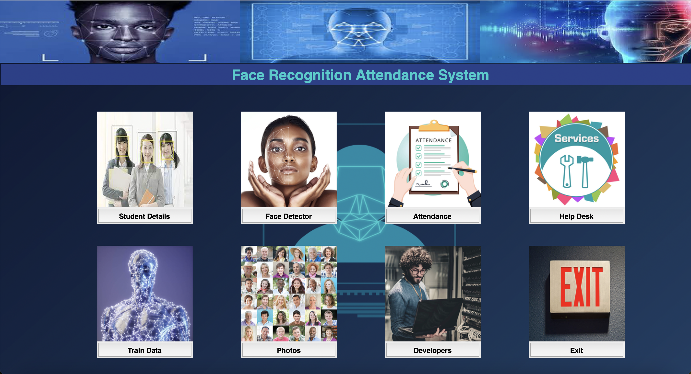
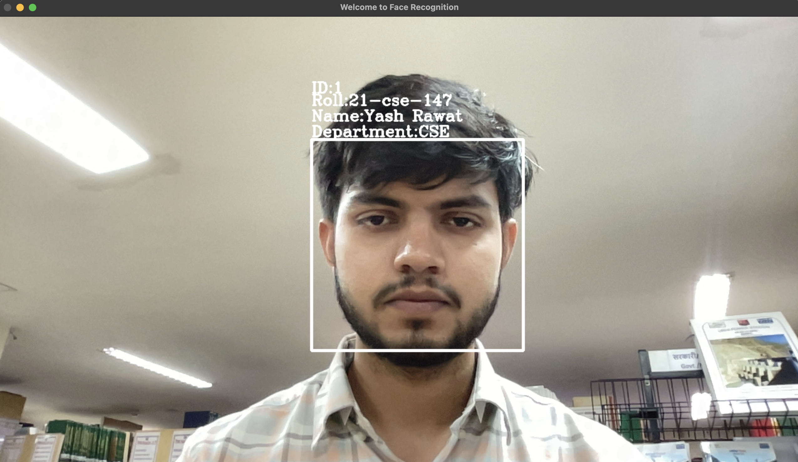
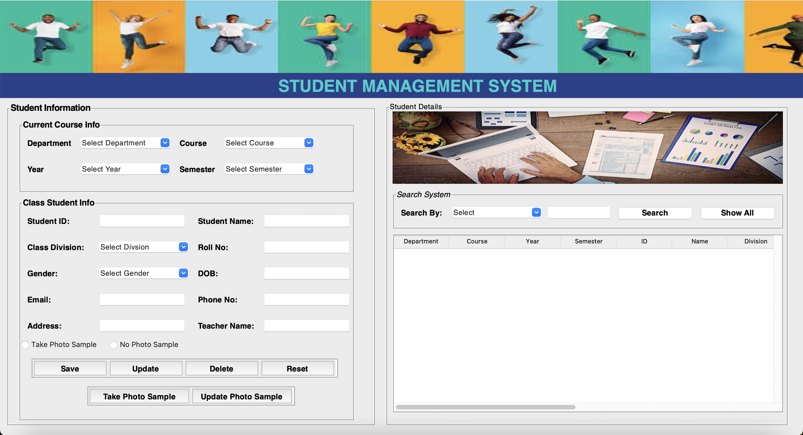
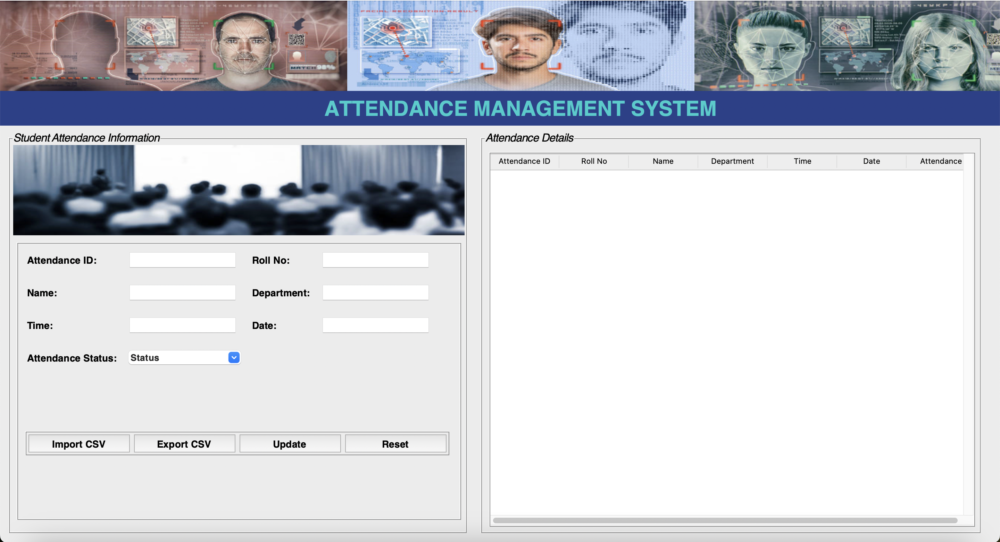
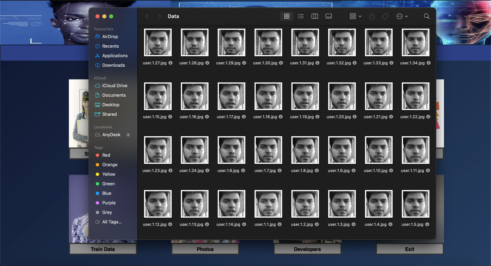

# Face Recognition Attendance System  

A **Face Recognition-based Attendance System** using **OpenCV, LBPH (Local Binary Pattern Histogram), Tkinter**, and **MySQL** for automated and efficient attendance management.

## Features ✨  
-  **Face Detection & Recognition** using **LBPH Algorithm**  
-  **Live Camera Feed** for real-time face recognition  
-  **Automated Attendance Marking** in a database  
-  **CSV Import/Export** for attendance data  
-  **User-Friendly GUI** built with **Tkinter**  
-  **Database Integration** with **MySQL**  

## Installation 🔧  
### **Prerequisites**  
Ensure you have Python installed and set up the required libraries:  

```bash
pip install opencv-python numpy pillow pandas mysql-connector-python
```

### **Clone the Repository**  
```bash
git clone https://github.com/yashrawat2362/face-recognition-attendance-system.git
cd face-recognition-attendance-system
```

### **Database Setup**  
1. Create a **MySQL database** and table for storing attendance records.  
2. Update the database credentials in the script.  

### **Run the Project**  
```bash
python main.py
```

## Usage   
- **Register New Faces**: Capture and store student images.  
- **Recognize Faces**: System matches live faces with stored data.  
- **Mark Attendance**: Automatically logs recognized students in the database.  
- **Export Attendance**: Save attendance records as CSV files.  

## Technologies Used   
- **Python**   
- **OpenCV**   
- **LBPH Algorithm**   
- **Tkinter**   
- **MySQL**   
- **CSV & Pandas**   

## Screenshots 🖼  




  

## Future Enhancements 🚀  
- Implement **Deep Learning (CNN) for better accuracy**  
- Add **Web-Based Dashboard**  
- Integrate **RFID for multi-authentication**  

## Contributing 🤝  
Feel free to fork this repository and contribute improvements!  

---

🚀 **Developed by [Yash Rawat](https://github.com/yashrawat2362)**  
